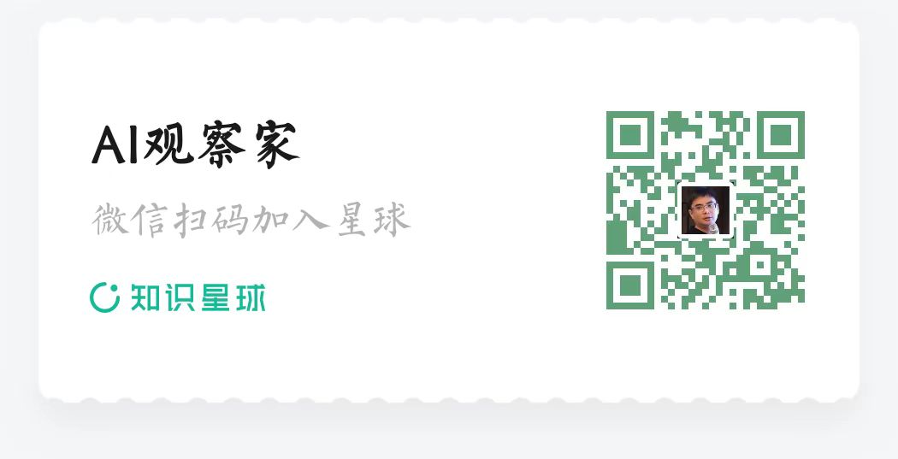

# AI Bootcamp

A comprehensive collection of AI development examples and tutorials designed for AI developers and practitioners.

**Note:** This repository is continuously updated with new examples showcasing emerging technologies in AI. We regularly add fresh content to help you stay current with mainstream and cutting-edge technologies in AI application development.

## 📚 Overview

This repository provides a curated collection of AI knowledge examples and practical implementations, covering:

- **Core LLM Knowledge Cases**: Fundamental concepts and implementations of large language models
- **Mainstream Framework Examples**: Hands-on examples using LangChain, LlamaIndex, CrewAI, and other popular frameworks
- **RAG (Retrieval-Augmented Generation) Examples**: Various RAG implementations and patterns
- **Agent Examples**: Multi-agent systems and intelligent agent implementations
- **MCP (Model Context Protocol) Examples**: Protocol implementations and integrations

## 🏗️ Project Structure

```
aibootcamp/
├── llm/                        # Core LLM knowledge and implementations
│   ├── easy-gpt/              # GPT model implementation from scratch
│   ├── qlora-example/         # QLoRA fine-tuning examples
│   └── ...
├── framework/                 # Framework-specific examples
│   └── langchain/            # LangChain framework examples
├── rag/                      # RAG implementations
│   ├── document-chat-rag/    # Document-based RAG system
│   ├── document-summary-rag/ # Document summarization RAG
│   ├── langextract-rag/      # Long text extraction RAG
│   ├── llamaindex-rag/       # LlamaIndex RAG examples
│   └── rag-on-milvus/        # Milvus-based RAG
├── agent/                    # Agent implementations
│   ├── crewai-ddd-expert/    # CrewAI DDD domain modeling
│   ├── crewai-flow-multimodal/ # CrewAI multimodal workflows
│   ├── crewai-quickstart/    # CrewAI quick start examples
│   └── langchain-react-agent/ # LangChain ReAct agent
├── mcp/                      # MCP (Model Context Protocol) examples
│   ├── finacial-analyst-deepseek/ # Financial analysis MCP
│   ├── mcp-agentic-rag/      # Agentic RAG MCP
│   └── sqlite-mcp/           # SQLite integration MCP
└── acp/                      # ACP (Agent Communication Protocol) examples
```

## 🚀 Quick Start

### Prerequisites

- Python >= 3.12
- [UV package manager](https://github.com/astral-sh/uv) (recommended)

### Installation

1. Clone the repository:
```bash
git clone <repository-url>
cd aibootcamp
```

2. Navigate to any project directory and install dependencies:
```bash
cd rag/document-chat-rag  # or any other project
uv sync
```

3. Follow the specific README in each project directory for detailed setup instructions.

## 📋 Project Categories

### 🤖 Core LLM Knowledge (`llm/`)
- **Easy GPT**: Complete GPT model implementation from scratch
- **QLoRA Examples**: Parameter-efficient fine-tuning with QLoRA
- **Music Recommendation**: LLM-based recommendation systems
- **Text Generation**: Various text generation techniques

### 🔗 Framework Examples (`framework/`)
- **LangChain**: Chain compositions, prompt templates, and agent patterns
- **LlamaIndex**: Vector store integration and query engines

### 🔍 RAG Implementations (`rag/`)
- **Document Chat RAG**: Streamlit-based document Q&A system with ChromaDB
- **Document Summary RAG**: Automated document summarization
- **Long Text Extract RAG**: Medical entity extraction from long documents
- **LlamaIndex RAG**: Comprehensive LlamaIndex examples
- **RAG on Milvus**: High-performance vector database integration

### 🤝 Agent Systems (`agent/`)
- **CrewAI DDD Expert**: Domain-driven design with multi-agent collaboration
- **CrewAI Flow Multimodal**: Multimodal RAG with audio and document processing
- **CrewAI Quickstart**: Getting started with CrewAI
- **LangChain ReAct Agent**: Reasoning and acting agent patterns

### 🔌 MCP Examples (`mcp/`)
- **Financial Analyst**: DeepSeek-powered financial analysis
- **Agentic RAG**: RAG system with agent capabilities
- **SQLite MCP**: Database integration with MCP

## 🛠️ Technology Stack

- **Python**: 3.12+ (consistent across all projects)
- **Package Management**: UV for fast and reliable dependency management
- **LLM Providers**: DeepSeek, OpenAI, Ollama
- **Vector Databases**: ChromaDB, Milvus
- **Frameworks**: LangChain, LlamaIndex, CrewAI
- **UI Frameworks**: Streamlit, Gradio
- **Embedding Models**: Ollama (nomic-embed-text)

## 📖 Usage Guidelines

1. **Isolated Dependencies**: Each project uses its own dependency management to avoid version conflicts
2. **UV Package Manager**: All projects use UV for consistent and fast package management
3. **Python Version**: All projects target Python 3.12+ for consistency
4. **Documentation**: Each project includes detailed README with setup and usage instructions

## 🤝 Contributing

1. Fork the repository
2. Create a feature branch
3. Make your changes
4. Add tests if applicable
5. Submit a pull request

## 👨‍💻 Author

### Zhang Yi(Bruce Zhang)
AI Strategy Consultant and AI-Native Application Developer, DDD Evangelist, Enterprise Mentor at Nanjing University DevOps+ Research Lab.

- GitHub: [@agiledon](https://github.com/agiledon)

**Copyright Notice**: Some examples in this repository are not original works but are referenced or copied from other authors' open source content. Specific copyright statements will be provided in the corresponding example project README files.

## 📜 License
This repository is licensed under the MIT License - see the [LICENSE](LICENSE) file for details.

---

# AI 训练营

为AI开发者和从业者提供的综合AI开发示例和教程集合。

**说明：** 本Repository会持续更新，我们会不断增加更多示例，展现AI领域的更多新技术，以帮助你及时了解与AI应用开发相关的主流和前沿技术。

## 📚 项目概述

本仓库主要提供与AI知识相关的示例集，内容包括：

- **大模型核心知识案例**：大语言模型的基础概念和实现
- **主流框架示例**：LangChain、LlamaIndex、CrewAI等流行框架的实践示例
- **RAG示例**：检索增强生成的各种实现和模式
- **Agent示例**：多智能体系统和智能体实现
- **MCP示例**：模型上下文协议的实现和集成

## 🏗️ 项目结构

```
aibootcamp/
├── llm/                        # 大模型核心知识和实现
│   ├── easy-gpt/              # 从零开始实现GPT模型
│   ├── qlora-example/         # QLoRA微调示例
│   └── ...
├── framework/                 # 框架特定示例
│   └── langchain/            # LangChain框架示例
├── rag/                      # RAG实现
│   ├── document-chat-rag/    # 基于文档的RAG系统
│   ├── document-summary-rag/ # 文档摘要RAG
│   ├── langextract-rag/      # 长文本提取RAG
│   ├── llamaindex-rag/       # LlamaIndex RAG示例
│   └── rag-on-milvus/        # 基于Milvus的RAG
├── agent/                    # 智能体实现
│   ├── crewai-ddd-expert/    # CrewAI领域驱动设计
│   ├── crewai-flow-multimodal/ # CrewAI多模态工作流
│   ├── crewai-quickstart/    # CrewAI快速入门
│   └── langchain-react-agent/ # LangChain ReAct智能体
├── mcp/                      # MCP（模型上下文协议）示例
│   ├── finacial-analyst-deepseek/ # 金融分析MCP
│   ├── mcp-agentic-rag/      # 智能体RAG MCP
│   └── sqlite-mcp/           # SQLite集成MCP
└── acp/                      # ACP（智能体通信协议）示例
```

## 🚀 快速开始

### 环境要求

- Python >= 3.12
- [UV包管理器](https://github.com/astral-sh/uv)（推荐）

### 安装步骤

1. 克隆仓库：
```bash
git clone <repository-url>
cd aibootcamp
```

2. 进入任意项目目录并安装依赖：
```bash
cd rag/document-chat-rag  # 或任意其他项目
uv sync
```

3. 按照每个项目目录中的详细README进行具体配置。

## 📋 项目分类

### 🤖 大模型核心知识 (`llm/`)
- **Easy GPT**：从零开始完整实现GPT模型
- **QLoRA示例**：参数高效微调QLoRA
- **音乐推荐**：基于LLM的推荐系统
- **文本生成**：各种文本生成技术

### 🔗 框架示例 (`framework/`)
- **LangChain**：链式组合、提示模板和智能体模式
- **LlamaIndex**：向量存储集成和查询引擎

### 🔍 RAG实现 (`rag/`)
- **Document Chat RAG**：基于Streamlit的文档问答系统，使用ChromaDB
- **Document Summary RAG**：自动化文档摘要
- **Long Text Extract RAG**：从长文档中提取医疗实体
- **LlamaIndex RAG**：全面的LlamaIndex示例
- **RAG on Milvus**：高性能向量数据库集成

### 🤝 智能体系统 (`agent/`)
- **CrewAI DDD Expert**：领域驱动设计与多智能体协作
- **CrewAI Flow Multimodal**：音频和文档处理的多模态RAG
- **CrewAI Quickstart**：CrewAI入门指南
- **LangChain ReAct Agent**：推理和行动智能体模式

### 🔌 MCP示例 (`mcp/`)
- **Financial Analyst**：基于DeepSeek的金融分析
- **Agentic RAG**：具有智能体能力的RAG系统
- **SQLite MCP**：数据库与MCP集成

## 🛠️ 技术栈

- **Python**：3.12+（所有项目保持一致）
- **包管理**：UV用于快速可靠的依赖管理
- **LLM提供商**：DeepSeek、OpenAI、Ollama
- **向量数据库**：ChromaDB、Milvus
- **框架**：LangChain、LlamaIndex、CrewAI
- **UI框架**：Streamlit、Gradio
- **嵌入模型**：Ollama（nomic-embed-text）

## 📖 使用指南

1. **独立依赖管理**：每个项目使用独立的依赖管理，避免版本冲突
2. **UV包管理器**：所有项目使用UV确保一致性和快速的包管理
3. **Python版本**：所有项目目标Python 3.12+保持一致性
4. **文档**：每个项目包含详细的README，提供设置和使用说明

## 🤝 贡献

1. Fork 仓库
2. 创建功能分支
3. 进行更改
4. 如适用，添加测试
5. 提交拉取请求

## 👨‍💻 作者

### 张逸

AI战略顾问，AI原生应用开发者，DDD布道者，南京大学DevOps+研究实验室企业导师。

- GitHub: [@agiledon](https://github.com/agiledon)

**版权声明**：本Repository的部分示例非原创，而是参考或复制了其余作者的开源内容。相关版权会在对应示例项目的README文件中给出具体声明。

## 📜 许可证

本仓库基于MIT许可证 - 详情请参阅 [LICENSE](LICENSE) 文件。

若需了解更多信息，欢迎加入张逸创建的知识星球-「AI观察家」。



## 🎯 学习建议

1. **循序渐进**：建议从基础LLM知识开始，逐步学习框架和高级应用
2. **实践为主**：每个示例都包含可运行的代码，建议动手实践
3. **项目导向**：选择感兴趣的项目深入学习和扩展
4. **社区交流**：欢迎在GitHub Issues中讨论问题和分享经验

## 🔗 相关资源

- [UV官方文档](https://docs.astral.sh/uv/)
- [LangChain文档](https://python.langchain.com/)
- [LlamaIndex文档](https://docs.llamaindex.ai/)
- [CrewAI文档](https://docs.crewai.com/)
- [DeepSeek平台](https://platform.deepseek.com/)